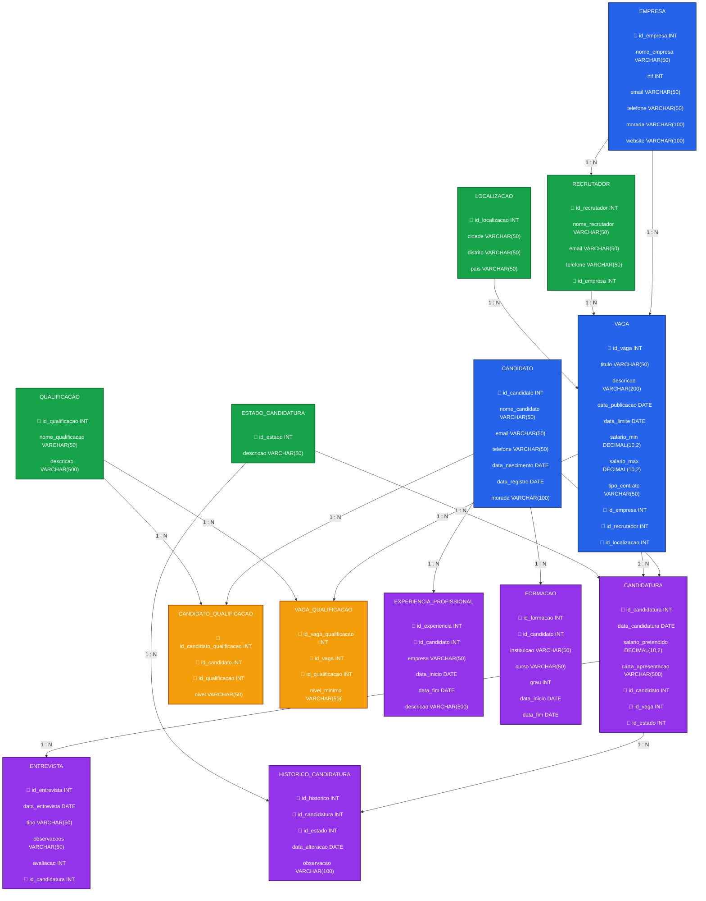

# **RECURSOS_HUMANOS**
Repositório para desenvolvimento de projeto para trabalho em grupo do curso TDS. 

## Criação de Tabelas
Alimentando as tabelas com as informações que cada uma carregará 

## Resumo
Este trabalho consiste na construção de uma base de dados em SQL e sua implementação, capaz de armazenar informações de uma determinada empresa e/ou organização. Nesse caso, nosso grupo optou por construir uma base de dados para uma empresa fictícia de Recursos Humanos. Foram desenvolvidas tabelas para sustentar essa base de dados, inseridos dados fictícios e realizado consultas, conforme exercício simulado para gerar um modelo relacional como resultado deste projeto.

## Autores

* Bruna Leite
* Tatiane Medeiros
* Gabriela Viana

# Diagrama Entidade-Relacionamento — Next People

